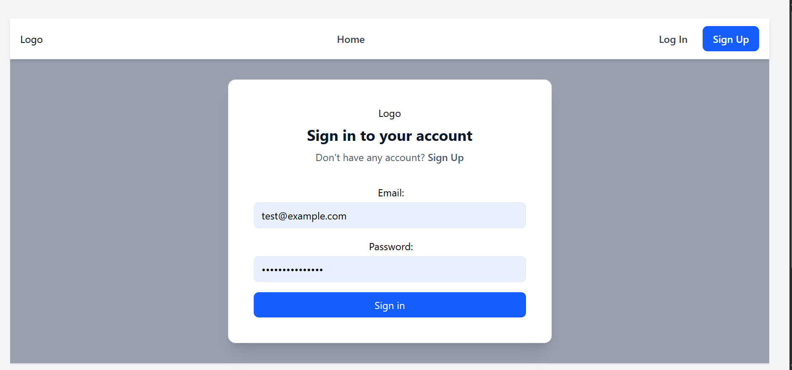

# 📝 Mega Blog

A full-featured blogging platform built with **React (Vite)**, **Appwrite** for backend services, and **TinyMCE** as a rich text editor.  
Users can sign up, log in, create posts with images, edit/update them, and browse blogs with a clean UI.  

🚀 **Live Demo:** [mega-blog-gray.vercel.app](https://mega-blog-gray.vercel.app)

---

## 🔑 Demo Credentials
Use these credentials to log in and explore the app:

- **Email:** test@example.com  
- **Password:** testpassword123  

---

## ✨ Features
- 🔐 **Authentication** (Sign up / Login / Logout with Appwrite Auth)  
- 📝 **Create / Edit / Delete Posts**  
- 🔗 **Auto-generated Slugs** for SEO-friendly URLs  
- 🖼️ **Image Uploads** with Appwrite Storage  
- 📰 **Rich Text Editor** (TinyMCE integration)  
- 📱 **Responsive UI** with Tailwind CSS  
- ⚡ **Fast Builds** using Vite + React Router DOM  

---

## 🛠️ Tech Stack
**Frontend:** React (Vite), React Router DOM, Redux, Tailwind CSS, TinyMCE  
**Backend / Services:** Appwrite (Auth, Database, Storage, CORS)  
**Deployment:** Vercel  

---

## 📂 Project Structure

src/

├── appwrite/ # Auth + Config for Appwrite SDK
├── components/ # Reusable UI components
├── pages/ # All main pages (Login, Signup, AddPost, AllPosts, etc.)
├── store/ # Redux slices and store setup
├── App.jsx # Root component with routes
├── main.jsx # ReactDOM + RouterProvider


---

## ⚙️ Environment Variables
Create a `.env` file in the root:

```env

VITE_APPWRITE_URL=https://fra.cloud.appwrite.io/v1
VITE_APPWRITE_PROJECT_ID=your_project_id
VITE_APPWRITE_DATABASE_ID=your_database_id
VITE_APPWRITE_COLLECTION_ID=your_collection_id
VITE_APPWRITE_BUCKET_ID=your_bucket_id
VITE_TINYMCE_API_KEY=your_tinymce_api_key   # optional (for production stability) 

```

  ## 🚀 Getting Started

1. Clone the repo
git clone https://github.com/your-username/mega-blog.git
cd mega-blog

2. Install dependencies
npm install

3. Add environment variables

Create .env with the values shown above.

4. Run locally
npm run dev

App will start at: http://localhost:5173

5. Build for production
npm run build


📸 Screenshots

🏠 Homepage 


🔑 Login Page


➕ Add Post


🔮 Future Improvements

Comments on posts

User profile page

Categories & tags

Dark mode

👨‍💻 Author

Manish Ubnare

🐙  [GitHub Profile](https://github.com/manishub45)

“Feel free to ⭐ this repo if you like it!”
